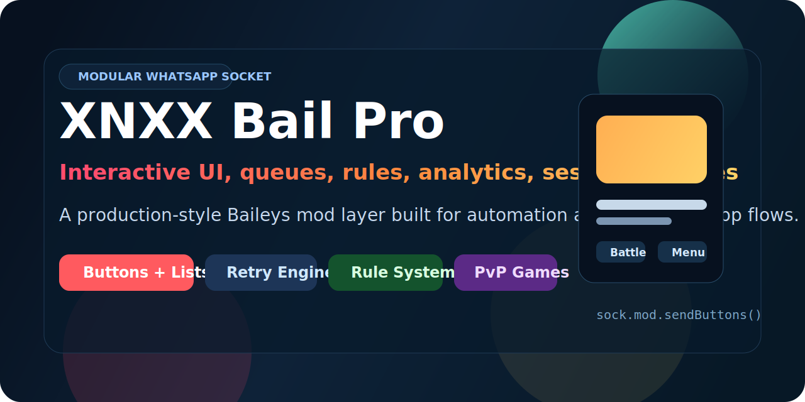
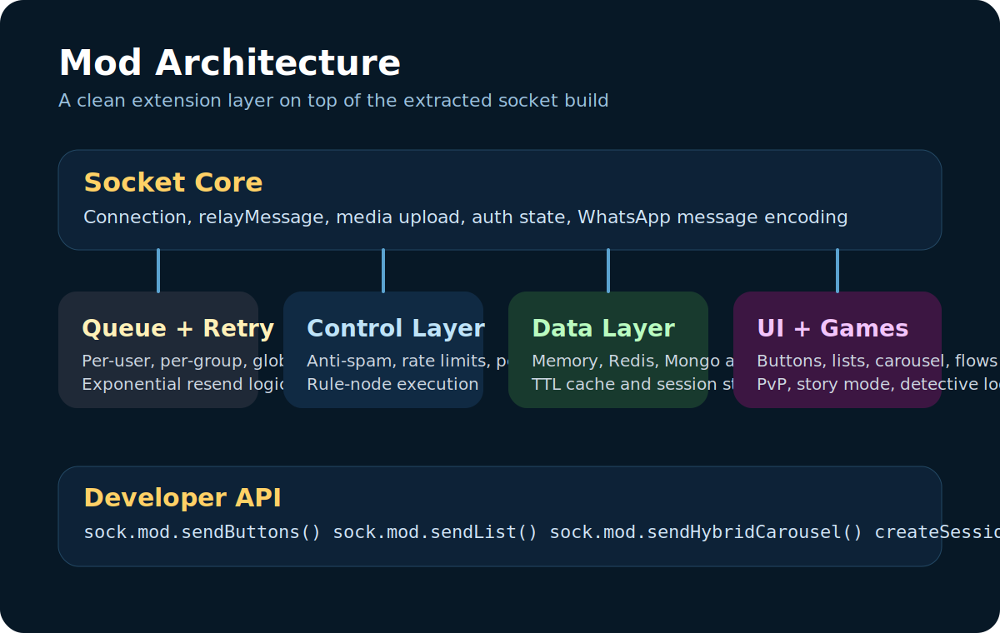

# XNXX Bail Pro

<p align="center">
  
</p>

<p align="center">
  <a href="https://www.npmjs.com/package/xnxx-bail-pro"></a>
  <a href="https://www.npmjs.com/package/xnxx-bail-pro"></a>
  <a href="https://github.com/xnx6x/xnxx-bail-pro"></a>
  <a href="https://github.com/WhiskeySockets/Baileys"></a>
</p>

<p align="center">
  
</p>

<p align="center">
  A modular WhatsApp Web API fork inspired by Baileys, now extended with a clean mod framework for automation, UI flows, analytics, rules, sessions, and game systems.
</p>

---

## Why this fork

Most Baileys-based mods keep stuffing features directly into socket internals until the project becomes hard to maintain.

This version moves toward a cleaner shape:

- `Socket core` handles connection, relay, auth, media, and protocol work
- `Mod framework` handles queues, retrying, rules, analytics, permissions, sessions, and UI helpers
- `Feature modules` stay isolated so new systems can be added without wrecking the base

The result is easier debugging, faster experiments, and a better path for keeping up with upstream Baileys changes.

---

## New in this mod layer

- Fixed outbound `buttons` and `list` payload generation
- Added import-safe banner behavior
- Added modular framework helpers on top of the extracted package build
- Added queue system with global, per-user, and per-group scheduling
- Added retry engine with backoff support
- Added store adapters for memory, Redis, and Mongo patterns
- Added anti-spam, rate limiting, and permission scaffolding
- Added analytics counters and group heatmap primitives
- Added rule engine with node-style conditions and actions
- Added session manager for isolated WhatsApp accounts
- Added UI helpers for buttons, lists, hybrid carousels, flow steps, and progress updates
- Added game foundations for PvP, loot RNG, story mode, and detective state

---

## Architecture

<p align="center">
  
</p>

---

## Feature map

### Core systems

- Queue system
- Retry engine
- Store system
- Multi-session scaffolding

### Control systems

- Anti-spam engine
- Rate limiter
- Permission system
- Rule engine

### UI systems

- Buttons
- Lists
- Carousel helpers
- Multi-step flow helpers
- Progress update helpers

### Game systems

- PvP battle state
- RNG loot drops
- Story branching state
- Detective case state

### Utility systems

- Analytics counters
- Message-forward scaffolding
- Cache-ready data adapters
- Session isolation helper

---

## Install

```bash
npm install xnxx-bail-pro
```

Or use it as a Baileys alias:

```json
{
  "dependencies": {
    "@whiskeysockets/baileys": "npm:xnxx-bail-pro"
  }
}
```

---

## Quick start

```js
import makeModularWASocket, { useMultiFileAuthState } from 'xnxx-bail-pro'

async function connect() {
  const { state, saveCreds } = await useMultiFileAuthState('auth_session')

  const sock = makeModularWASocket({
    auth: state,
    printQRInTerminal: true
  }, {
    queue: {
      global: { concurrency: 1, minIntervalMs: 100 },
      user: { concurrency: 1, minIntervalMs: 250 },
      group: { concurrency: 1, minIntervalMs: 150 }
    }
  })

  sock.ev.on('creds.update', saveCreds)
  sock.ev.on('connection.update', ({ connection }) => {
    if (connection === 'open') {
      console.log('connected')
    }
  })

  sock.ev.on('messages.upsert', async ({ messages }) => {
    const msg = messages?.[0]
    const jid = msg?.key?.remoteJid
    const text = msg?.message?.conversation || msg?.message?.extendedTextMessage?.text || ''
    if (!jid || msg?.key?.fromMe) return

    if (text === '.buttons') {
      await sock.mod.sendButtons(jid, {
        text: 'Choose an action',
        footer: 'XNXX Bail Pro',
        buttons: [
          { id: 'menu:open', text: 'Menu' },
          { id: 'battle:start', text: 'Battle' }
        ]
      })
    }
  })
}

connect()
```

---

## Rich UI examples

### Buttons

```js
await sock.mod.sendButtons(jid, {
  text: 'Choose an action',
  footer: 'Main control panel',
  buttons: [
    { id: 'battle:start', text: 'Start Battle' },
    { id: 'stats:view', text: 'View Stats' }
  ]
})
```

### Lists

```js
await sock.mod.sendList(jid, {
  title: 'Main Menu',
  text: 'Pick one module',
  buttonText: 'Open',
  sections: [
    {
      title: 'Systems',
      rows: [
        { id: 'analytics', title: 'Analytics', description: 'See activity data' },
        { id: 'games', title: 'Games', description: 'Play PvP and story mode' }
      ]
    }
  ]
})
```

### Hybrid carousel

```js
await sock.mod.sendHybridCarousel(jid, {
  body: 'Carousel demo',
  footer: 'Page 1',
  cards: [
    {
      title: 'Card One',
      text: 'Attach media and per-card buttons',
      buttons: [{ name: 'quick_reply', params: { display_text: 'Open', id: 'card:1' } }]
    },
    {
      title: 'Card Two',
      text: 'Use pagination helpers for long decks',
      buttons: [{ name: 'quick_reply', params: { display_text: 'Next', id: 'card:2' } }]
    }
  ]
})
```

---

## Module API

### Socket creation

```js
import makeModularWASocket from 'xnxx-bail-pro'
```

### Session manager

```js
import { createSessionManager } from 'xnxx-bail-pro'

const sessions = createSessionManager()
```

### Available helpers

- `sock.mod.sendQueued(jid, content, options)`
- `sock.mod.sendButtons(jid, payload, options)`
- `sock.mod.sendList(jid, payload, options)`
- `sock.mod.sendHybridCarousel(jid, payload, options)`
- `sock.mod.sendFlowStep(jid, flow, state, options)`
- `sock.mod.sendProgressUpdate(jid, payload, editKey, options)`

---

## Rule engine example

```js
const modConfig = {
  rules: [
    {
      id: 'block-link',
      when: {
        type: 'condition',
        left: 'text',
        operator: 'contains',
        right: 'https://'
      },
      then: [
        { type: 'reply', payload: { text: 'Links are not allowed here.' } }
      ]
    }
  ]
}
```

This is intentionally structured like a node system, not a pile of random `if/else` checks.

---

## Upstream maintenance

This package currently trails upstream `@whiskeysockets/baileys`, and upstream has already announced breaking changes in the `7.x` line.

Recommended maintenance strategy:

1. Keep protocol and socket fixes as close to upstream as possible.
2. Keep mod systems in isolated files under `lib/Mod`.
3. Rebase transport and message-building logic carefully when upstream changes land.
4. Avoid stuffing game logic, analytics, and rules directly into low-level socket files.

Upstream resources:

- [WhiskeySockets/Baileys](https://github.com/WhiskeySockets/Baileys)
- [Baileys migration guide](https://whiskey.so/migrate-latest)
- [Baileys wiki](https://baileys.wiki)

---

## Local development

Clone the real repository, then install:

```bash
npm install
```

Run your own entry file, for example:

```bash
node example.mod.js
```

If you want the startup banner:

```bash
set XNXX_BAIL_PRO_SHOW_BANNER=1
```

---

## Files added for this redesign

- `assets/readme-banner.svg`
- `assets/module-map.svg`
- `example.mod.js`
- `lib/Mod/*`

---

## Disclaimer

This library is not affiliated with WhatsApp. Use it responsibly, respect platform rules, and do not use it for abuse, spam, or harassment.
